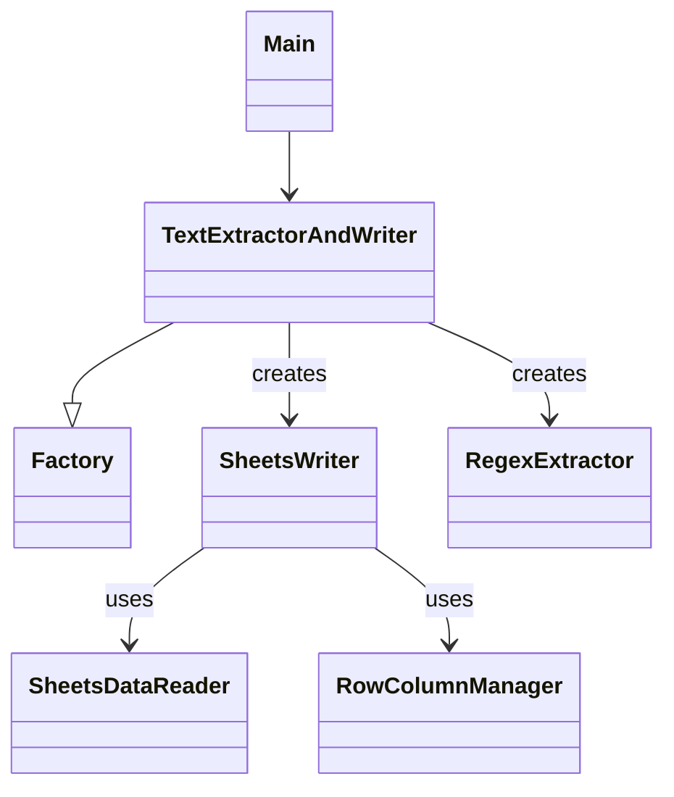
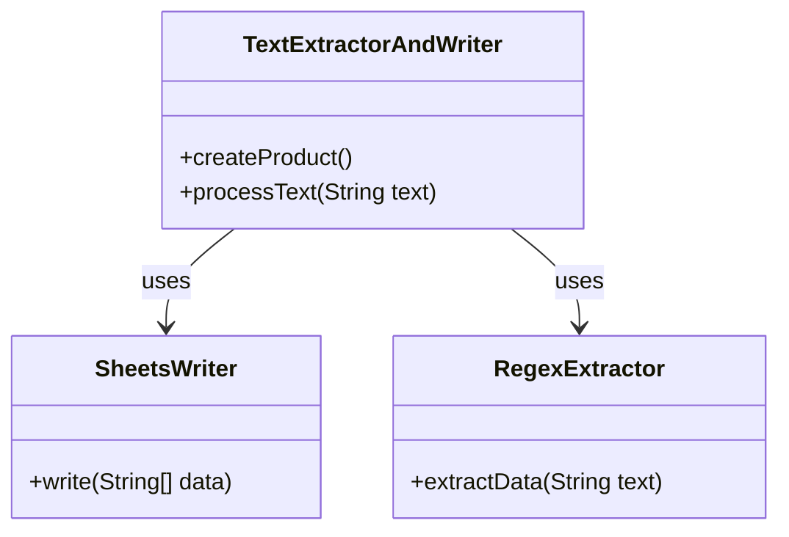
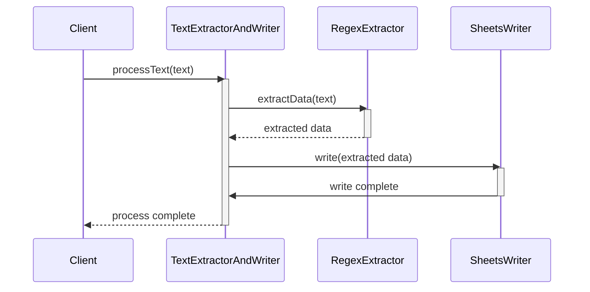

# TextExtractorFactory

```mermaid
classDiagram
Main --> TextExtractorAndWriter
TextExtractorAndWriter --|> Factory
TextExtractorAndWriter --> SheetsWriter: creates
SheetsWriter --> SheetsDataReader: uses
SheetsWriter --> RowColumnManager: uses
TextExtractorAndWriter --> RegexExtractor: creates
```

```mermaid
classDiagram
    class TextExtractorAndWriter {
        +createProduct()
        +processText(String text)
    }
    class SheetsWriter {
        +write(String[] data)
    }
    class RegexExtractor {
        +extractData(String text)
    }
    
    TextExtractorAndWriter --> SheetsWriter: uses
    TextExtractorAndWriter --> RegexExtractor: uses
```

```mermaid
sequenceDiagram
    participant Client
    participant TextExtractorAndWriter
    participant RegexExtractor
    participant SheetsWriter
    
    Client->>TextExtractorAndWriter: processText(text)
    activate TextExtractorAndWriter
    
    TextExtractorAndWriter->>RegexExtractor: extractData(text)
    activate RegexExtractor
    RegexExtractor-->>TextExtractorAndWriter: extracted data
    deactivate RegexExtractor
    
    TextExtractorAndWriter->>SheetsWriter: write(extracted data)
    activate SheetsWriter
    SheetsWriter->>TextExtractorAndWriter: write complete
    deactivate SheetsWriter
    
    TextExtractorAndWriter-->>Client: process complete
    deactivate TextExtractorAndWriter
    

```